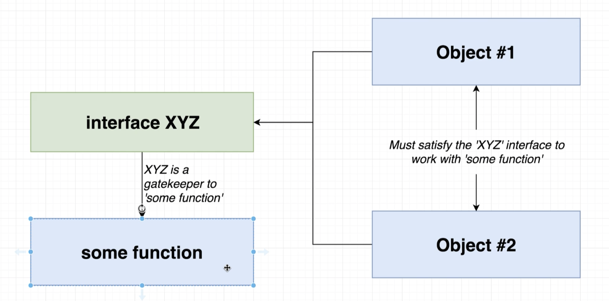
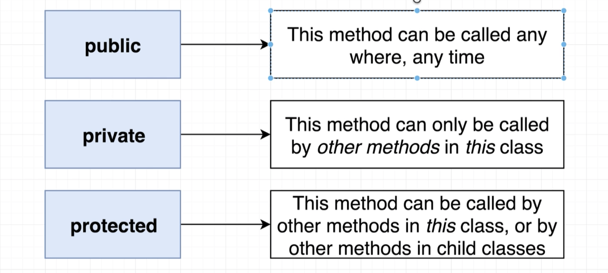

# Typescript: The Complete Developer's Guide


Course Overview:

## Syntax + Features

**Typing inference?**
  - Automatic detection of the type of an expression in a formal language
  - type inference: 
  ```
  Variable Declaration | Variable Initialization
  const color = 'red';
  ```
  *If declaration and initialization are on the same line, Typescript will figure out the type of 'color' for us.*

**What is an Interface in TS**
  - Creates a new type, describing the property names and value types of an object

**What is the syntax for defining an interface?**
- 
- One of TypeScript’s core principles is that type checking focuses on the shape that values have. This is sometimes called “duck typing” or “structural subtyping”. In TypeScript, interfaces fill the role of naming these types, and are a powerful way of defining contracts within your code as well as contracts with code outside of your project.
**Interface:**
  1. You can use any type inside interface definition. Not limited just to primitive values.
  2. Inside Interface definition you can express function inside as well
```
  interface Vehicle {
  name: string;
  year: Date;
  broken: boolean;
  summary(): string;
}
```


Questions:
The goal of an interface is to: Define a new type

### VS

## Design Patterns with TS

- How do we use inference to write reusable code?

### Course Goals

*Syntax + Features*
**Understand basic types in TS**
  - Easy way to refer to the different properties + functions that a value has
    - Properties + Methods a 'string' has in JS:
     ```
    charAt(), charCodeAt(), concat(), includes(), endsWith(), indexOf(), lastIndexOf(), localeCompare(), match().
     ```


**Function typing + annotations**
annotations -  `: number, : string, : boolean, : null, : undefined`
```
let apples: number = 5;
let speed: string = 'fast';
let hasName: boolean = true;

let nothingMuch: null = null;
let nothing: undefined = undefined;
```

**Type definition files**

**Arrays in TS**
  - TS can do type inference when extracting values from an array
  - TS can prevent us from adding incompatible values to the array
  - We can get help with 'map', 'forEach' and 'reduce' functions
  - Flexible - arrays can still contain multiple different types

When to use typed arrays?
  - Any time we need to represent a collection of records with some arbitrary sort order.

Tuple: (not used often)
  - Array-like structure where each element represents some property of a record
  - Fixed order

**Modules systems**

**Classes + Refresher on OOP**

  - **Classes:** Blueprint to create an object with some fields (values) and methods (functions) to represent a 'thing'

 

*Design Patterns*
- Projects

### Resources:

[JSONPlaceholder - free online REST API](http://jsonplaceholder.typicode.com/)