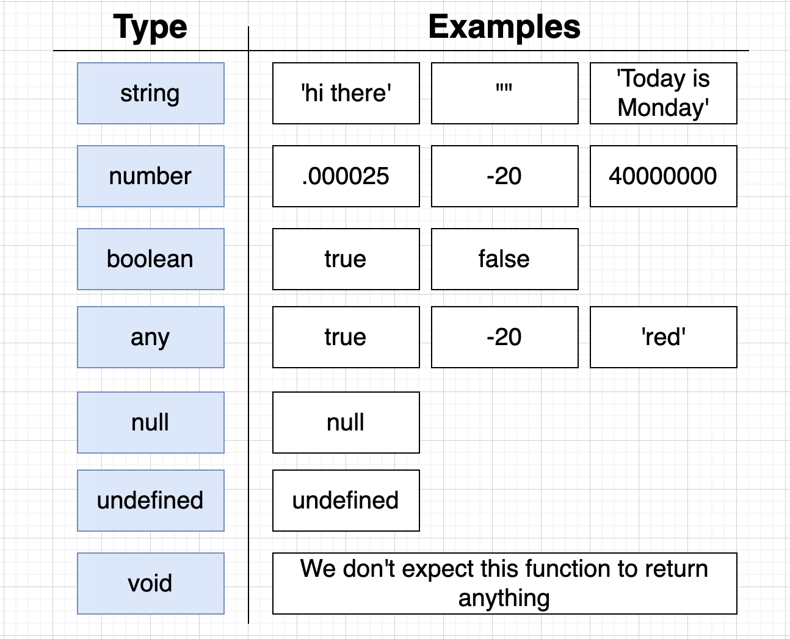
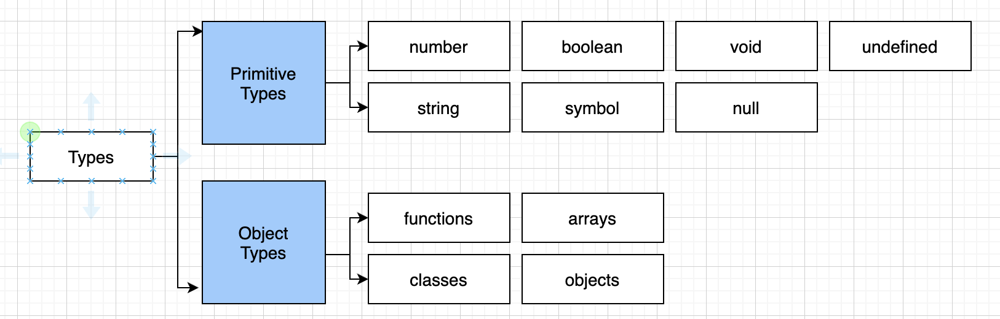

# Typescript: The Complete Developer's Guide


Course Overview:

## Syntax + Features

- What is an interface?
- What is the syntax for defining an interface?

### VS

## Design Patterns with TS

- How do we use interfaces to write reusable code?

### Course Goals

*Syntax + Features*
- **Understand basic types in TS**
  - Easy way to refer to the different properties + functions that a value has
    - Properties + Methods a 'string' has in JS:
     ```
    charAt(), charCodeAt(), concat(), includes(), endsWith(), indexOf(), lastIndexOf(), localeCompare(), match().
     ```



- **Function typing + annotations**
- **Type definition files**
- **Arrays in TS**
- **Modules systems**
- **Classes + Refresher on OOP**

*Design Patterns*
- Projects


### Resources:

[JSONPlaceholder - free online REST API](http://jsonplaceholder.typicode.com/)