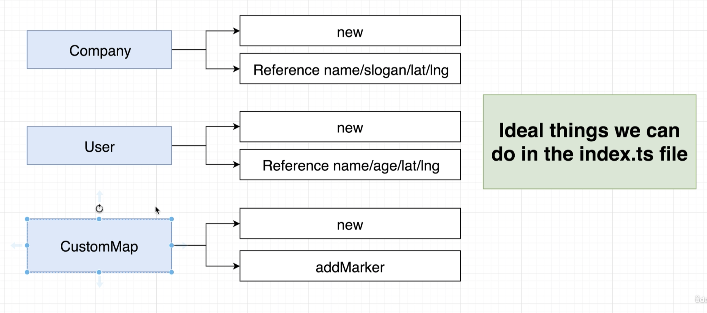
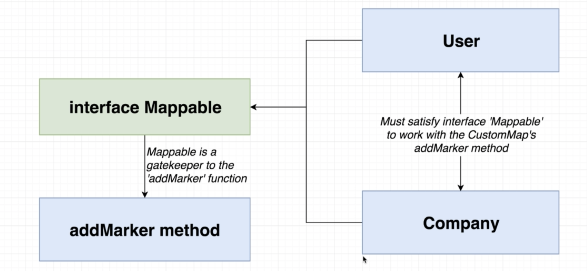

# Maps project

To run in terminal: 
 - parcel index.html 
### Resources

Google APIs:
[Google Dev Project](http://console.developers.google.com)

maps JavaScript API:
- enable Google Maps support inside project
- Generate an API key
- Add google maps script tag to HTML file

